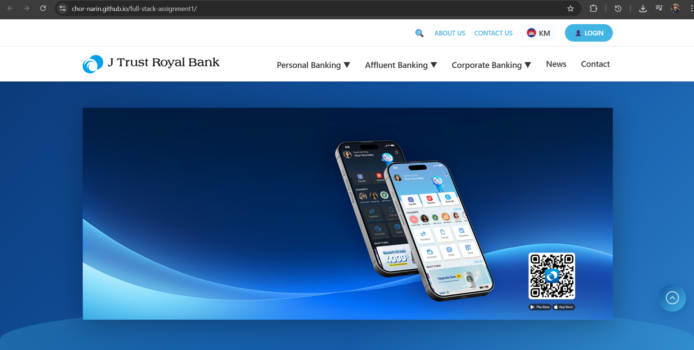
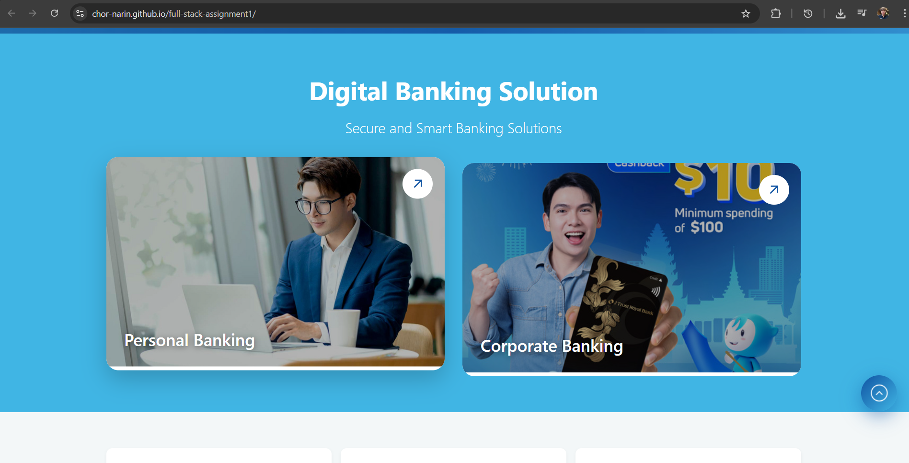
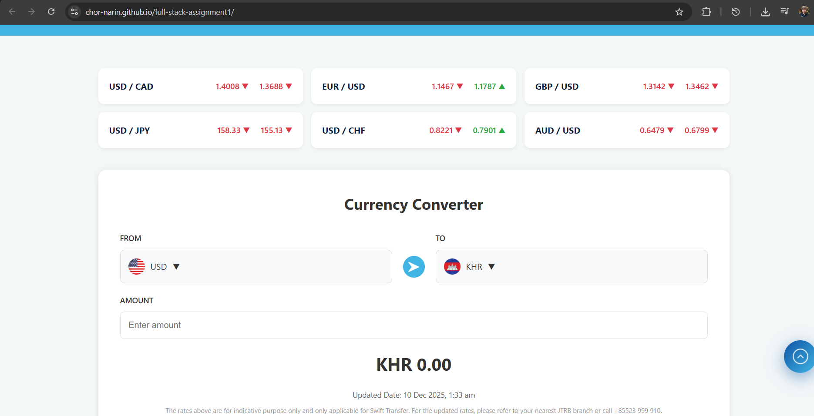

# J Trust Royal Bank – Official Website  
**Responsive Banking Website**  
**Narin Chor** (Batch 2 – Full-Stack Development)

Live Demo: https://chor-narin.github.io/full-stack-assignment1/

---

### Screenshots

**Desktop View**  
 

**Mobile View**  
  
  

---

### Implemented Features (100% Responsive)

- Fully responsive design – works perfectly on desktop, tablet, and mobile  
 Sticky navigation bar with smooth scroll  
 Mobile-first hamburger menu (80% width slide-in with overlay)  
 Mobile menu sub-items open on tap (Personal Banking → Deposit, Loan, Merchant)  
 Language selector dropdown (Khmer / English / Chinese) – works on click & hover  
 Currency exchange rates section  
 Currency converter (UI ready)  
 Pure CSS promotions slider with arrows and dots  
 Smooth animations on scroll (fadeInUp, slideInLeft/Right, floating phone)  
 Scroll-to-top button  
 Clean, modern UI matching real Cambodian banks (J Trust Royal, ABA, Acleda style)  
 Semantic HTML5 & clean CSS structure  
 No external frameworks (pure HTML + CSS + tiny vanilla JS)

---

### Technologies Used

- HTML5
- CSS3 (Flexbox, Grid, custom animations, media queries)
- Vanilla JavaScript (mobile menu + language toggle + submenu)
- Google Fonts – not used (system fonts only for performance)
- All images & icons from free sources (see credits below)

---

### Credits (Images & Assets)

| Asset Type       | Source                                      | License      |
|------------------|---------------------------------------------|--------------|
| Bank logo & mockups | Designed by instructor-provided assets + edited by me | Personal use |
| Flags (Cambodia, UK, China) | https://flagcdn.com                  | Free         |
| Navigation icons (deposit, etc.) | Created/edited from free SVG sources | Free         |
| Promotion cards  | J Trust Royal Bank official website (used for reference only) | Fair use for education |
| Background & hero images | Unsplash / Pexels (royalty-free)         | Free         |

All other graphics and styling created by me.

---

### How to Run Locally

1. Clone or download this repository
2. Open `index.html` in any browser
3. Or simply visit the live demo:  
   https://chor-narin.github.io/full-stack-assignment1/

No build tools or server required – pure static site

---

Made with ❤️ by **Narin Chor** – December 2025  
Batch 2 – Full-Stack Development  